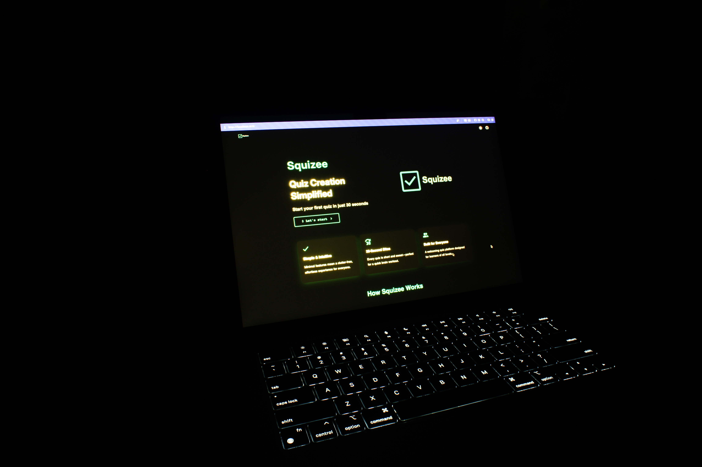

<h1>Squizee</h1>

### Repository name: Kanamachi

[Please visit my website here!!!](https://squizee.lozdo.com)

> **Quiz Creation Simplified**
> Start your first quiz in just 30 seconds

<p style="display: inline">
    <a href="https://www.docker.com/" target="_blank"></a>
    <a href="https://vuejs.org//" target="_blank"></a>
    <a href="https://www.typescriptlang.org/" target="_blank"></a>
    <a href="https://github.com" target="_blank"></a>
</p>



## Features

### 1. Simple & Intuitive

Minimal features mean a clutter-free, effortless experience for everyone.

### 2. 30-Second Bites

Every quiz is short and sweet—perfect for a quick brain workout.

### 3. Built for Everyone

A welcoming quiz platform designed for learners of all levels.

## Getting Started

### Prerequisites

- Docker & Docker Compose

### Installation

1. **Clone the repository**

    ```bash
    git clone git@github.com:youtame/kanamachi.git
    cd kanamachi
    ```

2. **Build the Docker container**

    ```bash
    docker compose up -d --build
    ```

3. **Visit Squizee!**
   [http://localhost:5173](http://localhost:5173 "http://localhost:5173")
   

## Library

| Library    | Version | Use it for                    |
| ---------- | ------- | ----------------------------- |
| Docker     | Latest  | Project execution environment |
| TypeScript | 6.0.0   | Site                          |
| Vite       | 8.0.8   | Site                          |
| Vue.js     | 3.5.3   | Site                          |
| Vue-router | 4.6.4   | Site                          |
| Vuetify    | 4.1.1   | Design                        |
| mdi JS     | 7.4.4   | Site Font                     |

## Cheat Sheet

You'll learn as you use it.
